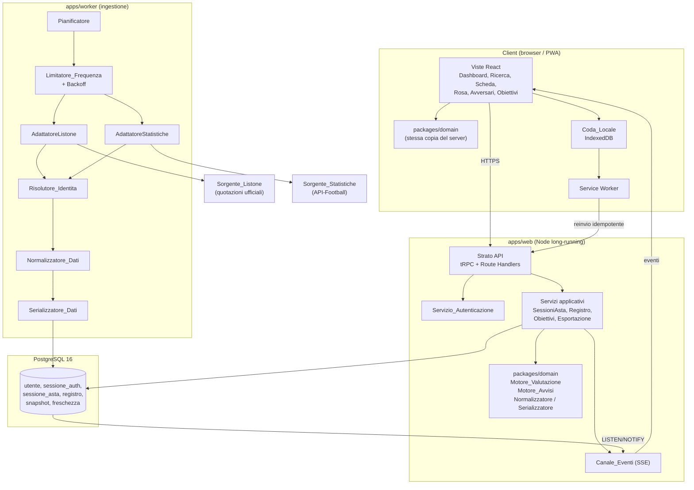
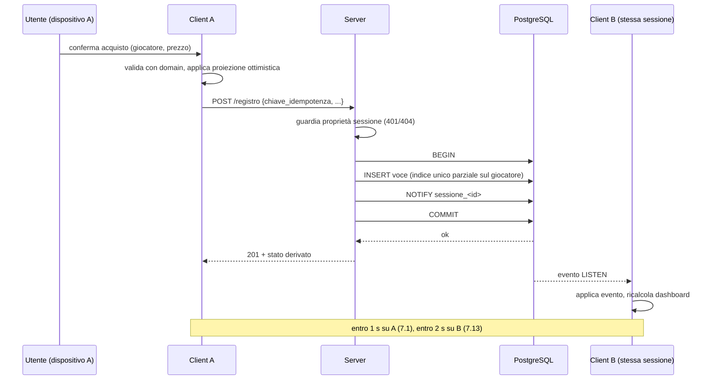
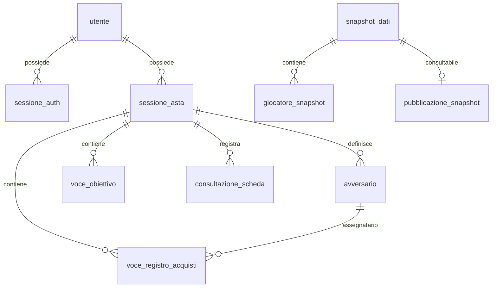
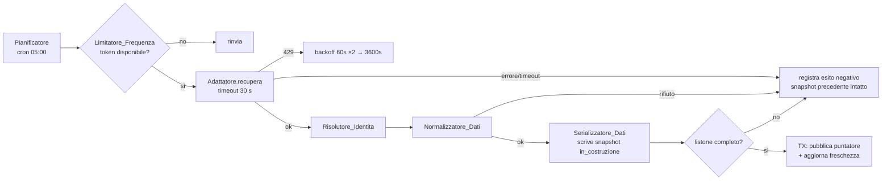

# Design Document

## Overview

`asta-fantacalcio-companion` è una web-app di supporto decisionale per l'asta del fantacalcio. Il design che segue traduce i 13 requisiti e le 17 proprietà di correttezza del documento dei requisiti in una architettura implementabile, e chiude le decisioni aperte da B1 a B9 dell'Appendice A.

Tre scelte strutturali guidano l'intero design.

**1. Lo stato dell'asta è derivato, non memorizzato.** L'unica scrittura persistente durante l'asta è la voce del `Registro_Acquisti`. `Budget_Residuo`, `Budget_Reparto_Residuo`, `Slot_Residui` e `Rosa_Utente` sono funzioni pure del `Registro_Acquisti` e della `Configurazione_Asta`. Le invarianti P3 (`somma(prezzi) + budget == crediti_iniziali`), P4 (`giocatori_reparto <= slot_reparto`) e la proprietà di round-trip P5 (`annulla(registra(s)) == s`) diventano vere per costruzione anziché per manutenzione: non esiste un contatore da tenere sincronizzato, quindi non esiste il bug che lo desincronizza.

**2. Il nucleo di dominio è puro e aritmeticamente intero.** `Motore_Valutazione`, `Motore_Avvisi`, `Normalizzatore_Dati` e `Serializzatore_Dati` vivono in un pacchetto senza I/O, senza orologio e senza numeri in virgola mobile. Tutte le grandezze decimali (media voto, fantamedia) sono rappresentate come interi in millesimi. Questo dà determinismo bit-per-bit, che è esattamente ciò che chiedono P6, P10 e P14, e permette di eseguire lo stesso codice sul server e sul client ottenendo lo stesso valore: il client può proiettare l'interfaccia immediatamente senza attendere il server, senza rischio di divergenza numerica.

**3. Il confine con il mondo esterno è un solo tipo di dato.** Ogni `Adattatore_Sorgente` produce un DTO canonico (`RispostaListoneGrezza`, `RispostaStatisticheGrezza`). Nessun altro componente conosce il provider. La sostituzione di una `Sorgente_Dati` (requisito 4.5) è quindi la sostituzione di un file più una riga di registrazione.

### Ambito del design

Coperto: autenticazione e isolamento tra utenti, gestione sessioni d'asta, acquisizione automatica dei dati, ricerca e scheda giocatore, motore di valutazione e indice di convenienza, registrazione acquisti con sincronizzazione multi-dispositivo, avvisi contestuali, dashboard, lista obiettivi, esportazione/importazione, uso in mobilità con coda offline.

Non coperto (fuori dalla prima versione, cfr. B7): analisi a posteriori delle aste concluse, apprendimento dei prezzi reali fra sessioni, sessioni condivise fra utenti.

---

## Decisioni tecnologiche

| Ambito | Scelta | Motivazione |
|---|---|---|
| Linguaggio | TypeScript 5.x, `strict` | Un solo linguaggio per dominio, server e client: il nucleo di dominio deterministico gira in entrambi i contesti senza riscritture. |
| Monorepo | pnpm workspaces + Turborepo | Il dominio puro deve essere un pacchetto isolabile e testabile senza avviare l'applicazione. |
| Front-end | Next.js 16 (App Router) + React 19.2 | SSR per il primo caricamento entro i budget di 3 s (12.2, 13.1), routing e API nello stesso progetto, PWA per la modalità offline. |
| Libreria di componenti | **Mantine 9.5** (`@mantine/core`, `@mantine/hooks`, `@mantine/form`, `@mantine/notifications`, `@mantine/modals`) | Copre nativamente tutto ciò che serve a questa applicazione: `Autocomplete`, `NumberInput`, `Slider`, `RingProgress`, `Alert`, `Badge`, `Table`, `AppShell`, `Modal`, notifiche. Nessun componente di interfaccia da costruire. Vedi "Componenti di interfaccia". |
| Stato client | TanStack Query 5 + store Zustand per la coda locale | Cache per query, riconciliazione con gli eventi push, coda offline separata dalla cache. |
| Stile | Sistema di temi di Mantine (PostCSS preset), nessun framework CSS aggiuntivo | Il vincolo 44×44 px del criterio 12.1 è impostato una sola volta nel tema tramite `theme.components` e vale per tutti i componenti, senza CSS per schermata. |
| Icone | `@tabler/icons-react` | Set già integrato con Mantine, nessuna icona da disegnare. |
| API | Route handlers Next.js + tRPC, contratti Zod | I contratti Zod sono le stesse funzioni di validazione dei criteri di rifiuto (3.22, 7.4, 8.6, 11.4): un solo punto di verità per i vincoli. |
| Persistenza | PostgreSQL 16 + Prisma | Vincoli dichiarativi (indice unico parziale) per l'unicità del giocatore nel registro; `jsonb` per statistiche a forma variabile; `LISTEN/NOTIFY` per il push. |
| Push multi-dispositivo | Server-Sent Events su `LISTEN/NOTIFY` | Unidirezionale, sufficiente per 7.13 (2 s), sopravvive ai proxy HTTP, non richiede un broker aggiuntivo. |
| Hashing password | Argon2id (`@node-rs/argon2`), 19 MiB / 2 iterazioni / parallelismo 1 | Parametri OWASP correnti; soddisfa 1.9. |
| Ingestione | Processo worker separato, `node-cron` + tabella di lock | L'acquisizione non deve competere con le richieste utente né dipendere dal ciclo di vita di una richiesta HTTP. |
| Storage offline | IndexedDB (`idb`) + Service Worker | Persistenza ≥ 24 h richiesta da 12.3, che `localStorage` non garantisce per volume e struttura. |
| Test | Vitest + fast-check (proprietà), Testcontainers (integrazione), Playwright (E2E e responsive) | fast-check copre P1–P17; Playwright copre 12.1 su viewport reali. |
| Deploy | Container Node long-running (Fly.io / Railway / VPS) | SSE e cron richiedono un processo persistente: il modello serverless è escluso. |

### Alternative valutate e scartate

- **WebSocket invece di SSE.** Il flusso è unidirezionale server→client; le mutazioni restano HTTP POST per riusare autenticazione, idempotenza e gestione errori. WebSocket aggiungerebbe un canale con proprie regole di riconnessione senza beneficio.
- **JWT stateless invece di sessioni opache in tabella.** Il criterio 1.7 richiede l'invalidazione immediata al logout e il criterio 1.8 la scadenza per inattività: entrambi richiedono stato lato server. Una denylist di JWT è uno stato lato server con più parti mobili.
- **Ricerca full-text lato server.** Il budget di 300 ms dall'ultimo carattere (5.3) su un massimo di 2000 giocatori si soddisfa meglio scaricando una volta l'indice di ricerca dello `Snapshot_Dati` (circa 200 KB compresso) ed eseguendo la ricerca in memoria sul client, azzerando la latenza di rete per ogni tasto premuto.
- **Calcolo della dashboard solo lato server.** 2000 valutazioni di aritmetica intera costano meno di un millisecondo: eseguirle nel client dopo ogni acquisto evita un giro di rete e mantiene il budget di 2 s di 13.6 con ampio margine.
- **Tailwind CSS più primitive non stilizzate (Radix, Headless UI).** Le primitive non stilizzate sono corrette in accessibilità ma richiedono di costruire ogni componente: campo numerico con incremento, autocompletamento, indicatore percentuale, tabella ordinabile. È esattamente il lavoro che questo progetto non deve fare.
- **shadcn/ui.** I componenti vengono copiati nel repository e diventano codice da mantenere; mancano nativamente il campo numerico e l'autocompletamento, che qui servono in quasi ogni schermata.
- **MUI.** Copertura funzionale comparabile a Mantine, ma senza equivalenti diretti di `useNetwork` e `useDebouncedValue`, che qui risolvono direttamente i criteri 12.5 e 5.3, e con un peso maggiore sul primo caricamento.

---

## Chiusura delle decisioni aperte (Appendice A, sezione B)

### B1 — Scelta dei provider

**Decisione.** Due canali indipendenti, entrambi dietro `Adattatore_Sorgente`.

- `Sorgente_Listone`: **file ufficiale delle quotazioni Fantacalcio®** (formato XLSX/CSV pubblicato per Classic e Mantra, [pagina quotazioni ufficiali](https://www.fantacalcio.it/quotazioni-fantacalcio)). È l'unica fonte che coincide per definizione con il listone usato dalle leghe: qualsiasi altra fonte introdurrebbe uno scostamento tra le quotazioni mostrate e quelle dell'asta reale. Non esiste una API pubblica documentata, quindi l'adattatore recupera il file pubblicato e lo interpreta.
- `Sorgente_Statistiche`: **API-Football (api-sports.io)** come provider iniziale. Copre Serie A con statistiche per giocatore (presenze, gol, assist, tiri, passaggi e relativa precisione, contrasti, duelli, parate, reti inviolate, cartellini, rigori) su endpoint REST documentati, con piano gratuito da 100 richieste al giorno e piani a pagamento con limiti dell'ordine delle centinaia di richieste al minuto ([piani](https://www.api-football.com/pricing), [funzionamento dei limiti](https://www.api-football.com/news/post/how-ratelimit-works)). Alternativa già prevista nel design: **Sportmonks**, che dichiara xG ed Expected Points per la Serie A ([Serie A API](https://www.sportmonks.com/football-api/serie-a-api/)), da attivare se i gol attesi del criterio 5.14 risultano indispensabili.

*Contenuto riformulato per conformità alle restrizioni di licenza delle fonti citate.*

**Conseguenza sul design.** I due canali hanno chiavi identità diverse e nessun identificativo comune. Serve quindi un `Risolutore_Identita` esplicito (descritto in "Servizio_Ingestione") che accoppia le voci del listone con le statistiche per nome normalizzato più squadra, con una tabella di alias persistente per gli scarti irrisolti. La `Sorgente_Listone` resta l'autorità su `Identificativo_Giocatore`, ruolo, squadra e `Quotazione`; la `Sorgente_Statistiche` non può creare giocatori.

**Da verificare prima dell'implementazione:** l'accesso effettivo agli endpoint statistici richiede una chiave attiva; le disponibilità dichiarate nella tabella B2 non sono state verificate contro una chiave reale.

### B2 — Statistiche tattiche effettivamente disponibili

**Decisione.** L'insieme dei criteri da 5.11 a 5.14 resta il contratto verso l'interfaccia; le statistiche che il provider attivo non fornisce sono contrassegnate come non disponibili secondo il criterio 4.12 e mostrate come "dato non disponibile" secondo il criterio 5.16.

| Macro_Reparto | Statistica richiesta | Disponibilità attesa su API-Football | Piano di ripiego |
|---|---|---|---|
| Portieri | parate, gol subiti, reti inviolate, rigori parati | attesa disponibile | — |
| Difensori | reti inviolate squadra, duelli difensivi vinti, contrasti, precisione passaggi | attesa disponibile; reti inviolate ricavate dall'aggregato squadra | — |
| Centrocampisti | assist, passaggi chiave, precisione passaggi, tiri | attesa disponibile | — |
| Attaccanti | gol, tiri, tiri nello specchio, **gol attesi (xG)** | **xG non atteso sul provider iniziale** | contrassegno "non disponibile" (4.12); attivazione dell'adattatore Sportmonks se l'assenza risulta bloccante |

**Valutazione di sufficienza.** L'assenza dei gol attesi non degrada il `Motore_Valutazione`, che per il criterio 6.2 usa esclusivamente le `Statistiche_Fantacalcio`: le `Statistiche_Tattiche` sono materiale di sola consultazione. L'insieme residuo per gli Attaccanti (gol, tiri, tiri nello specchio) è ritenuto sufficiente per la prima versione.

### B3 — Legittimità dell'acquisizione automatica

**Decisione.** Tre misure, tutte già rappresentate nell'architettura.

1. L'adattatore del listone recupera il **file di quotazioni pubblicato per il download**, non pagine HTML, con una richiesta al giorno per stagione, `User-Agent` identificativo dell'applicazione e rispetto di `robots.txt`. Una richiesta giornaliera a un file statico è il profilo di accesso meno invasivo compatibile con il criterio 4.3.
2. **Piano di ripiego obbligatorio, già nel design:** `AdattatoreListoneFileLocale`. Un operatore di sistema può depositare il file ufficiale delle quotazioni in un percorso di configurazione; il `Servizio_Ingestione` lo tratta come qualsiasi altra sorgente. Questo mantiene il sistema funzionante se la sorgente remota diventa inaccessibile o vieta l'accesso automatizzato, e **non viola il criterio 4.2**: l'operazione è di esercizio, non è esposta all'`Utente` e non esiste alcuna funzione di importazione nell'interfaccia utente.
3. Nessuna ridistribuzione dei dati grezzi: l'esportazione del criterio 10.5 contiene la `Rosa_Utente` e il `Registro_Acquisti` dell'utente, non il listone.

**Punto che richiede una verifica non tecnica:** la conformità alle condizioni d'uso della fonte va confermata dal titolare del progetto prima della pubblicazione. Il design rende questa verifica non bloccante per lo sviluppo, perché l'adattatore da file locale copre lo scenario peggiore.

### B4 — Frequenza di aggiornamento e costo delle chiamate

**Decisione.** Confermata la soglia di almeno un tentativo ogni 24 ore per canale (criterio 4.3), con questi budget:

- `Sorgente_Listone`: 1 richiesta al giorno per stagione. Il listone cambia raramente dopo la pubblicazione.
- `Sorgente_Statistiche`: acquisizione a lotti, 1 richiesta per squadra per stagione (circa 20 richieste) più 1 richiesta di indice, eseguita una volta al giorno alle 05:00 Europe/Rome. Totale circa 21 richieste al giorno, compatibile con i piani a pagamento di ingresso e fuori dal piano gratuito da 100 richieste al giorno solo in caso di ripetuti reinvii.
- Il `Limitatore_Frequenza` è configurato per sorgente e persistito, quindi il budget è rispettato anche dopo un riavvio (dettagli in "Servizio_Ingestione").

### B5 — Formula dell'Indice_Convenienza e pesi predefiniti

**Decisione.** Formule chiuse, interamente specificate nella sezione "Motore_Valutazione", con sei `Pesi_Valutazione` e preimpostazioni dei due `Profilo_Strategia` costruite in modo che la proprietà P8 (`aggressivo >= conservativo`) sia vera **per costruzione** e non per calibrazione: le due preimpostazioni differiscono in un solo peso, che entra nel calcolo come moltiplicatore monotono crescente.

### B6 — Stagioni multiple e indicatore di tendenza

**Decisione.** Prima versione a **stagione di riferimento singola**. Lo `Snapshot_Dati` porta una `stagione_listone` (quella dell'asta imminente) e una `stagione_statistiche` (quella conclusa), che normalmente differiscono: è precisamente il caso che il criterio 5.17 impone di dichiarare per singola statistica. Il modello dati marca la stagione a livello di statistica, quindi l'aggiunta di più stagioni con indicatore di tendenza è una estensione additiva. Il `Motore_Valutazione` della prima versione considera una sola stagione di statistiche.

### B7 — Analisi a posteriori delle aste concluse

**Decisione.** Fuori ambito per la prima versione. Il design conserva però i dati necessari: la tabella `consultazione_scheda` (criterio 5.18), il `Registro_Acquisti` completo comprensivo delle voci annullate e lo stato `completata` della `Sessione_Asta` (criterio 10.4). Nessun dato viene distrutto, quindi la funzione è aggiungibile senza migrazione dei contenuti storici.

### B8 — Regole di lega non standard

**Decisione.** Nessuna regola aggiuntiva nella prima versione. Gli intervalli dei criteri 3.3 e 3.4 (da 2 a 20 partecipanti, da 1 a 100000 crediti) e la `Composizione_Rosa` libera da 4 a 50 slot con da 1 a 25 slot per reparto coprono già rose asimmetriche e panchine estese, perché il numero di slot per reparto è configurabile liberamente entro il totale. Gli svincolati a prezzo fisso non sono modellati: sono registrabili come acquisti al prezzo indicato.

### B9 — Soglie non funzionali e concorrenza

**Decisione.** Soglie temporali dei requisiti confermate senza modifiche. Dimensionamento di riferimento:

| Grandezza | Valore di progetto |
|---|---|
| `Snapshot_Dati` massimo | 2000 giocatori (come da criteri 5.3 e 4.19) |
| Utenti concorrenti | 200 sessioni SSE simultanee su una singola istanza |
| Sessioni d'asta per utente | 50 (criterio 2.2) |
| Voci del `Registro_Acquisti` per sessione | 20 partecipanti × 50 slot = 1000 come limite superiore strutturale |
| Payload dell'indice di ricerca | circa 200 KB compressi, scaricato una volta per apertura di sessione |

Le soglie più severe (300 ms per la ricerca, 500 ms per la scheda e gli avvisi) sono soddisfatte per costruzione perché ricerca, valutazione e avvisi sono calcolati sul client su dati già presenti in memoria.

---

## Architettura



### Struttura del monorepo

```
asta-fantacalcio/
  apps/
    web/                    # Next.js: UI, API, SSE
    worker/                 # pianificatore e pipeline di ingestione
  packages/
    domain/                 # nucleo puro, nessun I/O, nessun float
      valutazione/           # Motore_Valutazione, Indice_Convenienza
      avvisi/                # Motore_Avvisi
      snapshot/              # Normalizzatore_Dati, Serializzatore_Dati
      stato-asta/            # derivazione di budget, slot, rosa
      esportazione/          # esporta / importa
    contracts/              # schemi Zod: DTO grezzi, API, formato di esportazione
    db/                     # schema Prisma, migrazioni, repository
    adapters/               # un file per Sorgente_Dati
```

Il confine `packages/domain` è la regola architetturale principale: **nessun import di `db`, `adapters`, `fetch`, `Date` o `Math.random`**. Il tempo e la casualità entrano come parametri espliciti. La violazione è verificata da una regola ESLint `no-restricted-imports` sul pacchetto, non lasciata alla disciplina.

### Flusso di una registrazione di acquisto



Il `COMMIT` avviene prima della risposta: il criterio 7.12 (persistere prima di confermare) è soddisfatto dall'ordine delle operazioni, non da un controllo aggiuntivo. In caso di errore o superamento dei 5 secondi (criterio 7.16), la transazione non è mai stata confermata, quindi lo stato persistito è invariato e il client annulla la proiezione ottimistica.

---

## Modello dei dati

### Schema relazionale



### Tabelle principali

**`utente`** — `id`, `email_normalizzata` (unico; minuscolo con spazi esterni rimossi, per il criterio 1.2), `email_visualizzata`, `password_hash` (Argon2id), `creato_il`.

**`sessione_auth`** — `id`, `utente_id`, `token_hash` (SHA-256 di un token opaco da 256 bit; il token in chiaro non è mai persistito), `creato_il`, `ultima_attivita_il`, `scade_il_assoluto` = `creato_il + 30 giorni`, `revocata_il`. Una sessione è valida se `revocata_il IS NULL AND now < ultima_attivita_il + 24h AND now < scade_il_assoluto` (criteri 1.1, 1.7, 1.8).

**`sessione_asta`** — `id`, `utente_id`, `nome`, `stagione_listone`, `stato` (`in_corso` | `completata`), `creato_il`, `aggiornato_il`, `avvisi_informativi_attivi`, e la `Configurazione_Asta`:

| Colonna | Tipo | Vincolo dai requisiti |
|---|---|---|
| `tipo_asta` | enum | 3.2, valore solo documentale (3.13, 3.14) |
| `modalita_gioco` | enum `classic` \| `mantra` | 3.2 |
| `numero_partecipanti` | int | 2–20 (3.3) |
| `crediti_iniziali` | int | 1–100000 (3.4) |
| `modificatore_difesa` | bool | predefinito falso (3.7) |
| `composizione_rosa` | jsonb `Record<Reparto, int>` | 3.5, 3.6 |
| `quote_reparto` | jsonb `Record<MacroReparto, int>` | somma 100 (3.8–3.10, 3.21) |
| `pesi_valutazione` | jsonb `PesiValutazione` | 3.15–3.19 |

Vincolo `UNIQUE (utente_id, nome)` per il criterio 2.1. Ogni contenuto `jsonb` è validato da uno schema Zod di `packages/contracts` sia in scrittura sia in lettura: il database garantisce la forma, il codice garantisce il significato.

**`voce_registro_acquisti`** — la tabella centrale.

| Colonna | Note |
|---|---|
| `id`, `sessione_asta_id` | |
| `ordinale` | intero monotono per sessione: fissa l'ordine cronologico richiesto da 10.5 e 10.6 |
| `identificativo_giocatore` | chiave verso lo `Snapshot_Dati` (4.16) |
| `nome_giocatore`, `ruolo`, `squadra` | copia dal momento della registrazione: consente di conservare la voce se il giocatore scompare dallo snapshot (4.17) |
| `reparto_assegnato`, `macro_reparto` | reparto effettivo di imputazione (vedi "Ruoli multipli in Mantra") |
| `prezzo_acquisto` | intero, **annullabile**: facoltativo per gli avversari (8.2) |
| `assegnatario_tipo` | `utente` \| `avversario` |
| `avversario_id` | annullabile, valorizzato solo se noto (8.2) |
| `annullata_il` | annullamento logico, mai cancellazione fisica (7.7) |
| `chiave_idempotenza` | UUID generato dal client: protegge i reinvii della `Coda_Locale` (12.3) |

Due vincoli di database fanno il lavoro che altrimenti sarebbe codice fragile:

```sql
-- un giocatore non può comparire in due voci attive: criteri 7.6 e 8.6
CREATE UNIQUE INDEX ux_registro_giocatore_attivo
  ON voce_registro_acquisti (sessione_asta_id, identificativo_giocatore)
  WHERE annullata_il IS NULL;

-- un reinvio della coda offline non crea un duplicato: criterio 12.3
CREATE UNIQUE INDEX ux_registro_idempotenza
  ON voce_registro_acquisti (sessione_asta_id, chiave_idempotenza);
```

La violazione del primo indice diventa una risposta 409 con la voce esistente e il suo assegnatario, che è esattamente il messaggio richiesto dai criteri 7.6 e 8.6.

**`voce_obiettivo`** — chiave `(sessione_asta_id, identificativo_giocatore)` (unicità del criterio 11.1), `prezzo_massimo_personale` annullabile (11.5), `priorita` predefinita 99 (11.8). Il limite di 200 voci (11.2) è verificato nella transazione di inserimento con `SELECT count(*) ... FOR UPDATE` sulla sessione.

**`consultazione_scheda`** — `(sessione_asta_id, identificativo_giocatore, istante)`, criterio 5.18.

**`snapshot_dati`** — `id`, `stagione_listone`, `stagione_statistiche`, `stato` (`in_costruzione` | `consultabile` | `superato`), `creato_il`, `num_giocatori`, `nome_sorgente_listone`, `nome_sorgente_statistiche`, `hash_contenuto`.

**`giocatore_snapshot`** — `(snapshot_id, identificativo_giocatore)`, `nome`, `nome_ricerca` (minuscolo, senza segni diacritici, per il criterio 5.1), `squadra`, `ruolo_classic`, `ruoli_mantra text[]`, `quotazione`, `stat_fantacalcio jsonb`, `stat_tattiche jsonb`.

**`pubblicazione_snapshot`** — `(stagione_listone PK, snapshot_id)`. Una sola riga per stagione: **la pubblicazione è un `UPDATE` di un puntatore in transazione**. Questo è il meccanismo che soddisfa il criterio 4.10 (nessuno stato intermedio visibile) e la proprietà P13 (mai uno snapshot parziale): finché il puntatore non cambia, i lettori vedono lo snapshot precedente per intero.

**`stato_freschezza`** — `(nome_sorgente, stagione)`, `ultimo_successo_il`, `ultimo_tentativo_il`, `ultimo_esito`, `dettaglio_errore`, `num_giocatori_acquisiti`, `budget_token`, `prossimo_tentativo_non_prima_di`. Copre i criteri 4.13, 4.14, 4.15 e la persistenza del limitatore di frequenza.

### Rappresentazione numerica

Nessun `float` in tutto il sistema. Media voto e fantamedia sono `int` in **millesimi** (`6.83` → `6830`). L'arrotondamento a due decimali richiesto dal criterio 10.3 avviene solo in fase di presentazione. Questa scelta è la condizione perché P6, P10 e P14 (determinismo su ripetizioni) siano dimostrabili anziché probabili, ed è ciò che rende identici i risultati calcolati sul client e sul server.

### Tipi di dominio

```ts
// packages/domain/stato-asta
export type Reparto = string;          // 'P'|'D'|'C'|'A' oppure ruolo mantra
export type MacroReparto = 'POR' | 'DIF' | 'CEN' | 'ATT';

export interface StatFantacalcio {
  readonly mediaVotoMilli: number | null;   // null = non disponibile (4.12, 5.16)
  readonly fantamediaMilli: number | null;
  readonly presenze: number | null;
  readonly gol: number | null;
  readonly assist: number | null;
  readonly ammonizioni: number | null;
  readonly espulsioni: number | null;
  readonly rigoriParati: number | null;
  readonly rigoriSbagliati: number | null;
  readonly autogol: number | null;
  readonly stagione: string;
}

export interface StatoSessione {           // interamente derivato dal registro
  readonly creditiIniziali: number;
  readonly budgetResiduo: number;
  readonly budgetRepartoResiduo: ReadonlyMap<MacroReparto, number>;
  readonly slotResidui: ReadonlyMap<Reparto, number>;
  readonly slotResiduiTotali: number;
  readonly riservaMinima: number;          // max(0, slotResiduiTotali - 1)
  readonly rosa: readonly VoceRosa[];
}

export function derivaStato(
  cfg: ConfigurazioneAsta,
  registro: readonly VoceRegistro[],
): StatoSessione;
```

`derivaStato` è l'unica funzione che produce lo stato d'asta. Le proprietà P3 e P4 sono asserzioni su questa funzione sola.

### Ruoli multipli in Mantra

I requisiti parlano di "il `Reparto` del `Giocatore`" al singolare, ma il listone Mantra assegna a un giocatore **più ruoli** (per esempio `Dc;Ds`). Il design risolve così:

- `giocatore_snapshot.ruoli_mantra` è un array; in modalità `classic` contiene un solo elemento.
- Nella `Dashboard_Asta` un giocatore compare in **ogni** sezione corrispondente a un suo ruolo, valutato con gli `Slot_Residui` di quella sezione.
- Alla registrazione dell'acquisto l'utente **scegle il ruolo di imputazione** fra quelli ammessi; la scelta è persistita in `reparto_assegnato`. Il valore predefinito proposto è il ruolo ammesso con più `Slot_Residui`, e a parità il primo in ordine di listone.
- `macro_reparto` è derivato da `reparto_assegnato`.

Questo è un **completamento dei requisiti, non una deviazione**: senza `reparto_assegnato` i criteri 7.5, 7.10 e 9.2 sarebbero indeterminati in modalità Mantra. È segnalato nella sezione "Punti da confermare".

---

## Componenti e interfacce

### Servizio_Autenticazione

```ts
interface ServizioAutenticazione {
  registra(email: string, password: string): Promise<Risultato<SessioneAuth, ErroreRegistrazione>>;
  accedi(email: string, password: string): Promise<Risultato<SessioneAuth, ErroreAccesso>>;
  esci(tokenSessione: string): Promise<void>;
  risolvi(tokenSessione: string): Promise<Utente | null>;  // aggiorna ultima_attivita_il
}
```

Dettagli che soddisfano requisiti specifici:

- **Normalizzazione email** (1.2): `email.trim().toLowerCase()` è la chiave unica; l'originale è conservato per la visualizzazione.
- **Validazione email** (1.4): presenza di `@`, parte di dominio non vuota dopo l'ultima `@`, lunghezza ≤ 254. Volutamente permissiva: rifiutare indirizzi validi ma esotici è un difetto peggiore che accettarne uno improbabile.
- **Risposta indistinguibile** (1.6): quando l'email non esiste, il servizio esegue comunque una verifica Argon2id contro un hash fittizio precalcolato, poi restituisce lo stesso errore. Senza questo, il tempo di risposta distinguerebbe i due casi e il criterio 1.6 sarebbe violato nel "comportamento osservabile".
- **Sessione scorrevole** (1.8): `ultima_attivita_il` è aggiornato al massimo una volta ogni 60 secondi per sessione, per non trasformare ogni lettura in una scrittura.
- **Cookie**: `sid`, `HttpOnly`, `Secure`, `SameSite=Lax`, `Path=/`.

### Guardia di accesso alle sessioni d'asta

Un solo punto di applicazione per i criteri 1.10 e 1.11, usato da ogni procedura che accetta un `sessioneAstaId`:

```ts
async function caricaSessionePropria(ctx: Contesto, id: string): Promise<SessioneAsta> {
  if (!ctx.utente) throw new ErroreHttp(401);                 // 1.10
  const s = await repo.trovaPerId(id);
  if (!s || s.utenteId !== ctx.utente.id) throw new ErroreHttp(404); // 1.11
  return s;
}
```

La distinzione 401/404 e l'indistinguibilità fra "non tua" e "inesistente" sono qui e solo qui. Una regola di lint vieta l'accesso diretto al repository delle sessioni d'asta dallo strato API, per impedire che una nuova procedura salti il controllo.

### Servizio_Ingestione

```ts
interface AdattatoreSorgenteListone {
  readonly nome: string;
  readonly limiti: LimitiFrequenza;
  recupera(stagione: string, ct: SegnaleAnnullamento): Promise<RispostaListoneGrezza>;
}

interface AdattatoreSorgenteStatistiche {
  readonly nome: string;
  readonly limiti: LimitiFrequenza;
  recupera(stagione: string, ct: SegnaleAnnullamento): Promise<RispostaStatisticheGrezza>;
}
```

`RispostaListoneGrezza` e `RispostaStatisticheGrezza` sono definiti in `packages/contracts` e sono l'**unico** vocabolario che il resto del sistema conosce. Il criterio 4.5 (confinamento delle modifiche all'adattatore) è quindi una proprietà del grafo delle dipendenze, verificabile staticamente.

Adattatori previsti: `AdattatoreListoneQuotazioniUfficiali`, `AdattatoreListoneFileLocale` (ripiego di B3), `AdattatoreStatisticheApiFootball`, `AdattatoreStatisticheSportmonks` (alternativa di B2).

**Pipeline.**



- **Limitatore_Frequenza** (4.7): token bucket per sorgente, persistito in `stato_freschezza.budget_token`, così il budget vale anche fra riavvii del worker.
- **Backoff** (4.8): alla segnalazione di superamento del limite, `prossimo_tentativo_non_prima_di = now + attesa`, con attesa da 60 s raddoppiata a ogni tentativo fino a 3600 s.
- **Timeout** (4.9): 30 s per richiesta tramite `AbortSignal`. Errore, timeout o rifiuto del normalizzatore producono **solo** una scrittura su `stato_freschezza`; nessuna tabella dello snapshot è toccata.
- **Atomicità** (4.10, P13): lo snapshot viene costruito in stato `in_costruzione` e diventa visibile solo con l'`UPDATE` del puntatore `pubblicazione_snapshot`. Gli snapshot `in_costruzione` non sono leggibili da nessuna query applicativa.
- **Registro delle acquisizioni** (4.15): stagione, istante, nome sorgente e numero di giocatori acquisiti su `stato_freschezza` più una riga di storico in `esecuzione_ingestione`.

**Risolutore_Identita** (conseguenza di B1). Le due sorgenti non condividono chiavi.

```ts
interface RisolutoreIdentita {
  accoppia(
    listone: readonly VoceListoneGrezza[],
    statistiche: readonly VoceStatisticheGrezza[],
    alias: readonly AliasGiocatore[],
  ): { accoppiati: Map<IdentificativoGiocatore, VoceStatisticheGrezza>; nonRisolti: readonly VoceStatisticheGrezza[] };
}
```

Chiave di accoppiamento: `(nome_normalizzato, squadra_normalizzata)`, dove la normalizzazione rimuove segni diacritici, punteggiatura e ordine dei termini del nome. Gli scarti finiscono in `alias_giocatore` come voci da risolvere e **non bloccano** la pubblicazione: il giocatore entra nello snapshot con le statistiche contrassegnate come non disponibili, che è il comportamento del criterio 4.12. `Identificativo_Giocatore` è sempre l'identificativo della `Sorgente_Listone` (stabile fra snapshot, come richiesto da 4.16); in sua assenza è `sha1(nome_normalizzato + '|' + squadra)` troncato a 16 caratteri esadecimali.

**Normalizzatore_Dati** (4.11, 4.12). Funzione pura `RispostaGrezza[] → Risultato<SnapshotDati, ErroreValidazione>`. Rifiuta l'intera risposta, indicando campo e `Identificativo_Giocatore`, se: quotazione non intera o fuori da 1–999; ruolo non appartenente agli insiemi `classic`/`mantra`; campo obbligatorio assente; nome oltre 100 caratteri; identificativo duplicato nella stessa risposta. Una statistica mancante non è un rifiuto: diventa `null` e la costruzione prosegue.

**Serializzatore_Dati** (4.18–4.21). `serializza: SnapshotDati → RappresentazionePersistente` e `deserializza` inversa. L'uguaglianza del criterio 4.21 è indipendente dall'ordine: la funzione di confronto ordina per `Identificativo_Giocatore` e compara campo per campo, inclusi i contrassegni di non disponibilità. P1 e P2 sono test su queste due funzioni.

### Motore_Valutazione

Il componente più delicato: deve soddisfare simultaneamente sette vincoli (6.3, 6.4, 6.6, 6.7, 6.10, 6.11, 6.12). Il design li soddisfa **per costruzione**, non per calibrazione.

```ts
export interface IngressoValutazione {   // esattamente gli input ammessi da 6.2
  readonly budgetResiduo: number;
  readonly budgetRepartoResiduo: number;
  readonly slotResiduiReparto: number;
  readonly slotResiduiTotali: number;    // riservaMinima = max(0, slotResiduiTotali - 1)
  readonly quotazione: number;
  readonly statFantacalcio: StatFantacalcio | null;
  readonly pesi: PesiValutazione;
}

export interface PesiValutazione {       // interi 0..100, almeno uno > 0 (3.16)
  readonly quotazione: number;           // w_q
  readonly budgetReparto: number;        // w_br
  readonly budgetTotale: number;         // w_bt
  readonly slotResidui: number;          // w_sl
  readonly statistiche: number;          // w_st
  readonly audacia: number;              // w_au — modificatore di propensione al rischio
}

export interface EsitoValutazione {
  readonly prezzoMassimoConsigliato: number;
  readonly vincoloAttivo: 'nessuno' | 'reparto_completo' | 'budget_minimo'
                        | 'tetto_globale' | 'tetto_reparto' | 'budget_reparto_esaurito';
  readonly datiIncompleti: boolean;                    // 6.13
  readonly spiegazione: readonly ContributoFattore[];  // 6.5
}

export function valuta(i: IngressoValutazione): EsitoValutazione;
```

#### Costanti di sistema

Non modificabili dall'utente, quindi non fanno parte dei dati della sessione e non violano il criterio 6.2.

| Costante | Valore | Significato |
|---|---|---|
| `FM_BASE`, `FM_ESCURSIONE` | 5000, 3000 | fantamedia 5.00 → 0, 8.00 → 1000 |
| `MV_BASE`, `MV_ESCURSIONE` | 5500, 1500 | media voto 5.50 → 0, 7.00 → 1000 |
| `PRESENZE_RIF` | 30 | presenze per affidabilità piena |
| `K_FM`, `K_MV`, `K_PRES` | 50, 25, 25 | pesi interni del punteggio di rendimento |
| `MR_MIN`, `MR_MAX` | 700, 1300 | moltiplicatore di rendimento in millesimi |
| `BONUS_SCARSITA` | 600 | ampiezza del bonus da pochi slot residui |
| `PASSO_AUDACIA` | 5 | millesimi di moltiplicatore per punto di audacia |

#### Algoritmo

Tutte le operazioni sono su interi non negativi con divisione troncata; nessuna divisione riceve un operando negativo, quindi il risultato è indipendente dalla semantica di arrotondamento del linguaggio.

**Passo 0 — riserva e tetti** (dal criterio 6.4)

```
riserva     = max(0, slotResiduiTotali - 1)
capGlobale  = budgetResiduo - riserva
capReparto  = budgetRepartoResiduo - (slotResiduiReparto - 1)
```

**Passo 1 — casi terminali**

```
se slotResiduiReparto == 0  →  prezzo = 0, vincolo = 'reparto_completo'     // 6.6, precedenza assoluta
se capGlobale < 1           →  prezzo = 1, vincolo = 'budget_minimo'        // 6.7
```

**Passo 2 — punteggio di rendimento `R ∈ [0, 1000]`** (dalle sole `Statistiche_Fantacalcio`)

```
termini = []
se fantamediaMilli ≠ null: termini += (K_FM,  min(1000, max(0, fantamediaMilli - 5000) * 1000 / 3000))
se mediaVotoMilli  ≠ null: termini += (K_MV,  min(1000, max(0, mediaVotoMilli  - 5500) * 1000 / 1500))
se presenze        ≠ null: termini += (K_PRES, min(presenze, 30) * 1000 / 30)

se termini è vuoto:  R = 500 ; datiIncompleti = vero        // 6.13
altrimenti:          R = Σ(k·v) / Σ(k) ; datiIncompleti = (|termini| < 3)

MR = 700 + R * 600 / 1000            // ∈ [700, 1300]; R = 500 → MR = 1000 (neutro)
```

**Passo 3 — quattro ancore in crediti, una per fattore**

```
A_quot = quotazione                                                  // valore di mercato
A_brep = max(0, budgetRepartoResiduo) / slotResiduiReparto           // quota equa di reparto
A_btot = max(0, capGlobale) / max(1, slotResiduiTotali)               // quota equa globale
A_slot = quotazione * (1000 + 600 / slotResiduiReparto) / 1000        // concentrazione su pochi slot
```

Le quattro ancore sono omogenee (crediti) e ciascuna è attribuibile a uno dei fattori del criterio 6.5, il che rende la spiegazione richiesta da 6.5 una lettura diretta del calcolo e non una ricostruzione a posteriori.

**Passo 4 — valore base**

```
Wb = w_q + w_br + w_bt + w_sl
valoreBase = Wb > 0
           ? (w_q·A_quot + w_br·A_brep + w_bt·A_btot + w_sl·A_slot) / Wb
           : quotazione                                     // nessun peso di anchor: mercato puro
```

**Passo 5 — rendimento e audacia**

```
Wm = Wb + w_st
moltRend = Wm > 0 ? (1000·Wb + MR·w_st) / Wm : 1000     // w_st = 0 → 1000 (neutro)
moltAud  = 1000 + 5·w_au                                 // ∈ [1000, 1500]

prezzoGrezzo = (valoreBase · moltRend / 1000) · moltAud / 1000
```

**Passo 6 — vincoli di bilancio**

```
prezzoRep = capReparto >= 1 ? min(prezzoGrezzo, capReparto) : prezzoGrezzo
prezzo    = min(capGlobale, max(1, prezzoRep))
```

#### Perché i vincoli sono soddisfatti per costruzione

| Requisito | Argomento |
|---|---|
| 6.6 (`slot = 0` → 0) | Passo 1, prima di ogni altro calcolo. |
| 6.7 (budget insufficiente → 1) | Passo 1, seconda condizione. |
| 6.3 (`prezzo >= 1`) | Passo 6: `max(1, ·)` seguito da `min(capGlobale, ·)` con `capGlobale >= 1` garantito dal passo 1. |
| 6.4 (`prezzo <= min(capGlobale, capReparto)`) | Passo 6 applica entrambi i tetti quando `capReparto >= 1`. Il caso `capReparto < 1` è una **contraddizione dei requisiti** ed è discusso sotto. |
| 6.11 / P6 (determinismo) | Solo aritmetica intera su operandi non negativi, nessun ingresso dall'ambiente. |
| 6.12 / P9 (monotonia in `Quotazione`) | `A_quot` e `A_slot` crescono con la quotazione, `A_brep` e `A_btot` non ne dipendono, `MR` non ne dipende. Quindi `valoreBase` è non decrescente; la divisione troncata di una funzione non decrescente è non decrescente; `min` e `max` con costanti conservano la monotonia. |
| 6.10 / P8 (`aggressivo >= conservativo`) | `prezzo` è non decrescente in `w_au`, e le due preimpostazioni differiscono **solo** in `w_au`. Vedi sotto. |
| 6.2 (soli input ammessi) | La firma di `valuta` non espone altro. Il tipo è il vincolo. |

**Contraddizione rilevata nei requisiti (6.3 contro 6.4).** Se il budget di reparto è esaurito (`capReparto < 1`) ma restano slot e budget globale, il criterio 6.3 impone `prezzo >= 1` e il criterio 6.4 impone `prezzo <= capReparto <= 0`: nessun valore li soddisfa entrambi. Il design risolve **a favore del 6.3**, coerentemente con la proprietà P7 che formula il limite superiore solo sul budget globale, e trattando la quota di reparto come una pianificazione e non come un vincolo rigido. In quel caso `vincoloAttivo = 'budget_reparto_esaurito'`, l'interfaccia lo dichiara e l'avviso del criterio 9.5 scatta comunque. Questa risoluzione è elencata in "Punti da confermare".

#### Verifica numerica delle formule

Le formule di questa sezione e quella dell'`Indice_Convenienza` sono state eseguite su 200.000 stati di sessione generati casualmente (budget da 0 a 1000, budget di reparto da -50 a 500 per includere il piano sforato, da 0 a 25 slot di reparto su un massimo di 50 totali, quotazioni da 1 a 999, statistiche parzialmente o totalmente assenti, pesi arbitrari da 0 a 100). Nessuna violazione di 6.4, 6.6, 6.7, 13.7, P6, P7, P8, P9, P14, P15.

Esempio di lettura, attaccante di fascia alta con pesi predefiniti — budget residuo 500, budget di reparto residuo 200, 6 slot di reparto su 25 totali residui, quotazione 24, fantamedia 7.42, media voto 6.31, 33 presenze:

| Grandezza | Valore |
|---|---|
| Prezzo massimo consigliato | 28 crediti |
| Indice di convenienza | 89 |
| Con profilo `conservativo` | 26 crediti |
| Con profilo `aggressivo` | 36 crediti |

Il prezzo supera la quotazione perché il rendimento è sopra la media e il budget di reparto lo consente; l'indice è alto perché il prezzo consigliato resta sotto il doppio della quota equa di reparto (33 crediti per slot).

#### Pesi predefiniti e Profilo_Strategia (chiude B5)

| Peso | Predefinito | `conservativo` | `aggressivo` |
|---|---|---|---|
| `quotazione` (w_q) | 30 | 30 | 30 |
| `budgetReparto` (w_br) | 25 | 25 | 25 |
| `budgetTotale` (w_bt) | 15 | 15 | 15 |
| `slotResidui` (w_sl) | 10 | 10 | 10 |
| `statistiche` (w_st) | 20 | 20 | 20 |
| `audacia` (w_au) | 20 | **0** | **80** |

Le due preimpostazioni differiscono solo in `audacia`. Non è una semplificazione: è la condizione perché il criterio 6.10 valga per **ogni** stato di sessione e **ogni** giocatore. Se i profili ridistribuissero i pesi fra le ancore, esisterebbero stati in cui l'ancora più pesata dal profilo aggressivo vale meno delle altre e il prezzo aggressivo risulterebbe inferiore, violando P8. L'utente resta libero di modificare tutti i pesi dopo l'applicazione del profilo (criterio 3.19), e in quel caso il confronto fra profili non è più garantito, come è corretto.

Nota sul criterio 6.5: la spiegazione mostra i cinque fattori di dato richiesti (`Budget_Residuo`, `Budget_Reparto_Residuo`, `Slot_Residui`, `Quotazione`, `Statistiche_Fantacalcio`) con valore usato, ancora in crediti, peso e contributo. `audacia` è mostrata separatamente come modificatore, insieme alla rettifica di arrotondamento e al `vincoloAttivo`, così che la somma dei contributi mostrati riconcili sempre con il prezzo esposto.

### Indice_Convenienza

Input ammessi dal criterio 13.4: prezzo massimo consigliato, quotazione, statistiche, slot residui del reparto, budget di reparto residuo, pesi.

```
se slotResiduiReparto == 0 → 0                                        // 13.7

quotaSlot = max(1, max(0, budgetRepartoResiduo) / slotResiduiReparto)

rapportoMercato = prezzo · 1000 / max(1, quotazione)
c_marg = min(1500, max(500, rapportoMercato)) - 500      // 0.5× → 0 ; 1.5× → 1000
c_rend = R                                                // stesso punteggio del motore prezzo
rapportoQuota = prezzo · 1000 / quotaSlot
c_acc  = 2000 - min(2000, rapportoQuota)                  // ≤ quota equa → 1000 ; 2× → 0

u_marg = w_q ; u_rend = w_st ; u_acc = w_br + w_sl ; U = u_marg + u_rend + u_acc
num = u_marg·c_marg + u_rend·c_rend + u_acc·c_acc

indice = U > 0 ? (2·num + 10·U) / (20·U) : (2·c_marg + 10) / 20    // arrotondamento a metà per eccesso
indice = min(100, max(0, indice))
```

L'intervallo del rapporto di mercato è ampio esattamente 1000 millesimi, così la normalizzazione è una sottrazione e non una divisione: un'operazione in meno significa un arrotondamento in meno. P15 (`0 <= indice <= 100`) è garantito dal clamp finale, P14 dall'aritmetica intera pura, P16 dall'ordinamento della dashboard.

I giocatori non appartenenti a `Giocatore_Disponibile`, quando l'utente li include (criterio 13.10), non hanno prezzo consigliato (criterio 8.12) e quindi non hanno indice: sono mostrati con `—` e collocati dopo tutte le voci valorizzate. L'invariante 13.14 si applica alle voci con indice.

### Motore_Avvisi

```ts
export function valutaAvvisi(i: IngressoAvvisi): readonly Avviso[];

export interface Avviso {
  readonly criterio: number;                 // 2..8 del requisito 9, oppure 11.6
  readonly livello: 'informativo' | 'attenzione' | 'critico';
  readonly valori: Readonly<Record<string, number | string>>;
  readonly chiaveMessaggio: string;          // il testo vive nello strato di presentazione
}
```

Ogni condizione dei criteri da 9.2 a 9.8 più quella del criterio 11.6 è un predicato puro separato, valutato una volta, che produce al massimo un avviso. L'ordinamento (criterio 9.9) è un `sort` stabile per `(livello desc, numero di criterio asc)`. Il determinismo di P10 segue dalla purezza dei predicati e dalla stabilità dell'ordinamento; il tetto di 8 avvisi (criterio 9.1) è un troncamento dopo l'ordinamento, quindi elimina sempre i meno gravi. Gli avvisi `informativo` sono filtrati prima dell'ordinamento se disattivati (criteri 9.1, 9.11); i predicati che dipendono dal prezzo consigliato (criteri 9.4 e 11.6) sono esclusi per i giocatori non disponibili (criterio 9.13).

Poiché il motore è puro e gira sul client su dati già in memoria, il budget di 500 ms del criterio 9.9 non è a rischio; il ramo di indisponibilità del criterio 9.14 esiste come rete di sicurezza sul caso di stato non ancora caricato.

### Canale_Eventi (sincronizzazione multi-dispositivo)

```
GET /api/sessioni/:id/eventi        → text/event-stream
```

Alla connessione il server verifica la proprietà con `caricaSessionePropria`, esegue `LISTEN sessione_<id>` e invia un evento iniziale con l'ordinale corrente. Ogni mutazione emette `NOTIFY` **nella stessa transazione** della scrittura: se la transazione fallisce, la notifica non esiste, e non può quindi verificarsi il caso di un evento che annuncia una scrittura mai avvenuta.

Il payload trasporta l'`ordinale` della voce. Il client che riceve un ordinale non contiguo rispetto al proprio richiede il delta con `GET /api/sessioni/:id/registro?dopoOrdinale=N`: la riconciliazione non dipende dalla consegna ordinata di tutti gli eventi. Riconnessione con `Last-Event-ID`, ripiego su polling a 5 s se lo stream non è disponibile, `keep-alive` ogni 25 s per attraversare i proxy.

### Componenti di interfaccia

**Regola vincolante del progetto.** L'interfaccia si costruisce con i componenti di `@mantine/core`. Un componente nuovo è ammesso **solo** se soddisfa entrambe le condizioni: è una composizione di componenti Mantine esistenti, e non introduce CSS proprio oltre alle proprietà di layout già offerte da Mantine (`gap`, `justify`, `align`, `span`). Se una schermata sembra richiedere un componente visivo nuovo, la prima ipotesi da verificare è che esista già in Mantine con un nome diverso.

#### Mappatura schermata → componenti esistenti

| Schermata | Requisiti | Componenti Mantine usati |
|---|---|---|
| Registrazione e accesso | 1.1–1.6 | `Container`, `Paper`, `TextInput`, `PasswordInput`, `Button`, `Anchor`, `Alert`, `@mantine/form` con resolver Zod |
| Elenco sessioni d'asta | 2.3, 2.4, 2.7, 2.8, 2.10 | `AppShell`, `SimpleGrid`, `Card`, `Badge`, `Menu`, `Button`, `Text`; `modals.openConfirmModal` per la conferma con il nome della sessione (2.8) |
| Configurazione asta | 3.1–3.23 | `Stepper`, `TextInput`, `NumberInput` (interi, `clampBehavior`, `min`/`max` dai criteri), `Select`, `SegmentedControl` (modalità di gioco), `Switch` (modificatore di difesa), `Slider`, `Progress` (somma delle quote verso 100), `Table` (slot per reparto), `Accordion` (ruoli Mantra e loro macro-reparto), `Tooltip`, `@mantine/form` |
| Barra di stato persistente | 10.1 | `AppShell.Header`, `Group`, `Badge`, `Progress`, `RingProgress` |
| Dashboard | 13.1–13.11 | `Tabs` o `SimpleGrid` per le sezioni di reparto, `Table`, `RingProgress` (indice), `Badge`, `MultiSelect` (squadra), `RangeSlider` (quotazione 1–999), `Switch` (includi non disponibili), `Skeleton`, `Alert` (freschezza) |
| Ricerca giocatore | 5.1–5.6 | `Autocomplete` con `useDebouncedValue`, `Highlight` per la porzione corrispondente, `Text` per i messaggi di soglia e assenza risultati |
| Scheda giocatore | 5.7–5.18, 6.5, 9.x | `Drawer` su viewport stretti e `Modal` su viewport ampi, `SimpleGrid` di `Paper` per le statistiche, `Table` (spiegazione dei cinque fattori di 6.5), `RingProgress`, `Alert` (avvisi), `Badge` (non disponibile, dati incompleti), `Tooltip` (stagione di riferimento), `NumberInput` + `Button` (registrazione acquisto), `Select` (ruolo di imputazione in Mantra) |
| Rosa | 10.2, 10.3, 10.4, 10.7 | `Accordion` per reparto, `Table`, `Badge`, `Text` |
| Avversari | 8.3, 8.14 | `Table`, `TextInput`, `NumberInput`, `ActionIcon` |
| Lista obiettivi | 11.1–11.9 | `Table` ordinabile, `NumberInput` (prezzo personale, priorità 1–99), `Badge` (non raggiungibile), `SegmentedControl` (criterio di ordinamento) |
| Coda offline e conflitti | 12.3–12.9 | `Indicator` con il conteggio, `@mantine/notifications`, `Modal` con due `Paper` a confronto, `Button` per la scelta |
| Esportazione e importazione | 10.5, 10.8, 10.9 | `Button`, `FileButton`, `notifications.show`, `Alert` |
| Stati di caricamento ed errore | trasversali | `LoadingOverlay`, `Skeleton`, `Loader`, `Alert`, `notifications` |

#### Hook già disponibili che risolvono requisiti specifici

| Hook | Requisito servito |
|---|---|
| `useDebouncedValue` | 5.3, ricerca entro 300 ms dall'ultimo carattere |
| `useNetwork` | 12.3, 12.5, rilevamento della connessione e indicatore di coda |
| `useMediaQuery` | 12.1, scelta fra `Drawer` e `Modal` per la scheda |
| `useLocalStorage` | preferenze per sessione, come la disattivazione degli avvisi informativi (9.11) |
| `useListState` | riordino della lista obiettivi (11.9) |

#### Componenti di composizione ammessi

Cinque, tutti pura composizione, nessuno con CSS proprio. Ogni altra richiesta va discussa prima di essere implementata.

| Componente | Composizione | Perché non basta il componente Mantine da solo |
|---|---|---|
| `BarraStatoAsta` | `AppShell.Header` + `Group` + `Badge` + `Progress` | Il criterio 10.1 richiede la visibilità permanente di budget e slot senza navigazione: è una composizione riusata da tutte le viste della sessione |
| `CampoRicercaGiocatore` | `Autocomplete` + `useDebouncedValue` + `Highlight` | Aggiunge solo la logica di soglia a 2 caratteri (5.4) e i suggerimenti a distanza di edit ≤ 2 (5.5) |
| `ListaAvvisi` | `Alert` per elemento | Traduce `Avviso[]` in colore, icona e ordine; nessuna resa grafica nuova |
| `IndicatoreConvenienza` | `RingProgress` + `Text` | Fissa una sola volta la scala 0–100 e la soglia di colore, usato in dashboard e scheda |
| `SelettoreQuoteReparto` | `NumberInput` per reparto + `Progress` | Concentra la validazione della somma pari a 100 dei criteri 3.9 e 6.14 |

#### Vincolo 44×44 px impostato una volta nel tema

Il criterio 12.1 non si soddisfa schermata per schermata, ma nella configurazione del tema:

```ts
export const tema = createTheme({
  components: {
    Button:     Button.extend({ defaultProps: { size: 'md' } }),
    ActionIcon: ActionIcon.extend({ defaultProps: { size: 'lg' } }),
    TextInput:  TextInput.extend({ defaultProps: { size: 'md' } }),
    NumberInput: NumberInput.extend({ defaultProps: { size: 'md', allowDecimal: false } }),
    Select:     Select.extend({ defaultProps: { size: 'md' } }),
  },
});
```

`allowDecimal: false` come valore predefinito globale merita attenzione: tutti i valori numerici dei requisiti sono interi (crediti, slot, percentuali, priorità, pesi), quindi impedire i decimali nel tema elimina alla radice un'intera classe di rifiuti di validazione (criteri 3.22, 6.14, 7.4, 11.4) invece di gestirli a valle. Il test Playwright del criterio 12.1 misura le dimensioni effettive, così una regressione nel tema fallisce la build anziché passare inosservata.

### Client: ricerca, coda locale, offline

**Indice di ricerca.** All'apertura della sessione il client scarica `GET /api/snapshot/corrente/indice`: array compatto di `{id, nome, nomeRicerca, squadra, ruoli, quotazione}` con `Cache-Control` e `ETag` sull'`hash_contenuto` dello snapshot. `nomeRicerca` è precalcolato lato server in forma minuscola e priva di segni diacritici (NFD con rimozione dei segni combinanti), quindi il confronto insensibile a maiuscole e accenti del criterio 5.1 è un semplice `includes` su una stringa già normalizzata. I suggerimenti a distanza di edit ≤ 2 del criterio 5.5 usano Levenshtein con taglio anticipato sui soli nomi di lunghezza compatibile.

**Coda_Locale.** Store IndexedDB `coda_locale`, massimo 50 operazioni (criterio 12.4), ciascuna con `chiaveIdempotenza`, `tentativi`, `stato` (`in_attesa` | `in_invio` | `non_inviata` | `in_conflitto`). Reinvio al ripristino della connessione, massimo 5 tentativi a intervalli crescenti 10/20/40/80/160 s, tutti ≥ 10 s (criterio 12.3). La persistenza IndexedDB copre il requisito di conservazione ≥ 24 h. Un indicatore permanente mostra il numero di operazioni in attesa (criterio 12.5).

**Conflitti** (criteri 12.8, 12.9). Il server risponde `409` con la voce attiva esistente. Il client marca l'operazione `in_conflitto` e non modifica nulla: mostra le due versioni a confronto e attende la scelta. La scelta invia `POST /api/sessioni/:id/registro/conflitti/:chiave` con `{risoluzione: 'locale' | 'server'}`; `locale` annulla la voce del server e ne inserisce una nuova nella stessa transazione.

**Responsive** (criterio 12.1). Realizzato con `AppShell` e `SimpleGrid` con `cols` per breakpoint, senza media query scritte a mano: colonna singola sotto `sm`, due colonne a `md`, tre da `lg`. Nessun contenitore a larghezza fissa superiore a 360 px. La dimensione minima degli elementi interattivi arriva dal tema. Verificato da Playwright a 360, 768, 1024 e 1920 px con controllo dell'assenza di scorrimento orizzontale.

### Esportazione e importazione

Formato **JSON** con identificatore di schema `asta-fantacalcio-companion/export/v1`, non CSV: la proprietà P12 richiede la fedeltà del round-trip su una struttura annidata (configurazione, rosa, registro ordinato, assegnatari), che un formato tabellare rappresenterebbe solo con convenzioni implicite.

```ts
interface FileEsportazione {
  schema: 'asta-fantacalcio-companion/export/v1';
  esportatoIl: string;
  configurazione: ConfigurazioneAsta;
  rosa: { identificativoGiocatore: string; nome: string; reparto: string; prezzoAcquisto: number }[];
  registro: VoceRegistroEsportata[];   // ordine cronologico per ordinale (10.5)
  firma: string;                        // sha256 del corpo canonicalizzato
}
```

L'importazione (criterio 10.9) rifiuta il file se non leggibile, se la firma non corrisponde, se lo schema è ignoto o se `configurazione` differisce da quella della sessione di destinazione, confrontata campo per campo con messaggio che indica il primo campo divergente. L'importazione avviene in una sola transazione: la sessione di destinazione resta nello stato precedente in caso di qualsiasi rifiuto.

---

## Gestione degli errori

Un solo tipo di risultato attraversa il dominio, e le eccezioni sono riservate ai difetti di programmazione.

```ts
type Risultato<T, E> = { ok: true; valore: T } | { ok: false; errore: E };
```

| Classe di errore | Trattamento | Requisiti |
|---|---|---|
| Validazione di ingresso | `400` con `codice`, `campo`, `vincolo` e i valori già immessi, che l'interfaccia ripopola | 2.11, 3.22, 6.14, 7.4, 8.4, 11.4 |
| Non autenticato | `401`, nessun dato | 1.10 |
| Non proprietario o inesistente | `404` identico nei due casi | 1.11, 2.12 |
| Conflitto di stato | `409` con la voce in conflitto e il suo assegnatario | 7.6, 8.6, 12.8 |
| Limite di capacità | `409` con limite e valore corrente | 2.11 (50 sessioni), 11.2 (200 obiettivi), 12.4 (50 in coda) |
| Persistenza fallita o oltre 5 s | transazione non confermata, `503`, il client annulla la proiezione ottimistica | 7.16 |
| Sorgente esterna indisponibile | nessuna modifica agli snapshot, solo `stato_freschezza` | 4.9, P13 |
| Dati sorgente non validi | rifiuto dell'intera risposta con campo e identificativo, snapshot precedente conservato | 4.11, P13 |
| Statistica assente | `null` più contrassegno, costruzione completata | 4.12, 5.16, 6.13 |
| Ripristino sessione incompleto | apertura interrotta, dati persistiti invariati, ritentabile | 2.6 |
| Timeout del motore avvisi | scheda mostrata con avvisi non disponibili, stato invariato | 9.14 |

Due principi trasversali. **Primo:** ogni percorso di errore che tocca dati persistiti lascia lo stato esattamente come prima, perché tutte le mutazioni sono in transazione singola. **Secondo:** i messaggi di rifiuto riportano sempre il vincolo violato e il valore ammesso, come i requisiti chiedono ripetutamente, e i valori immessi dall'utente sono restituiti nella risposta perché l'interfaccia possa ripopolare il modulo senza conservarli separatamente.

---

## Strategia di test

### Test basati su proprietà (`packages/domain`, fast-check)

Il dominio è puro, quindi le 17 proprietà si testano senza infrastruttura. Le arbitrarie generano stati di sessione validi per costruzione: configurazione coerente, registro con giocatori distinti, prezzi entro il budget.

| Proprietà | Funzione sotto test | Arbitraria |
|---|---|---|
| P1 | `deserializza ∘ serializza` | snapshot da 1 a 2000 giocatori, statistiche parzialmente assenti |
| P2 | `normalizza ∘ serializza ∘ normalizza` | risposte grezze valide |
| P3, P4 | `derivaStato` | configurazione + sequenza di registrazioni valide |
| P5 | `annulla ∘ registra` | stato + acquisto valido |
| P6 | `valuta` ripetuta 10 volte | ingresso di valutazione arbitrario |
| P7 | `valuta` | stati con `slot >= 1` e `capGlobale >= 1` |
| P8 | `valuta` con preimpostazioni | stessi ingressi, pesi `conservativo` e `aggressivo` |
| P9 | `valuta` su coppie | stesse statistiche, quotazioni ordinate |
| P10 | `valutaAvvisi` ripetuta | stato + giocatore |
| P11 | `creditiResiduiStimati` | annotazioni per avversario |
| P12 | `importa ∘ esporta` | rose complete e parziali |
| P13 | `normalizza` su risposte non valide | mutazioni dirette che violano il criterio 4.11 |
| P14, P15 | `indiceConvenienza` | ingressi arbitrari |
| P16 | ordinamento della dashboard | insiemi di giocatori valutati |
| P17 | `valuta`, `indiceConvenienza`, `valutaAvvisi` | stesso stato con `tipo_asta` variato su tutti i valori |

P17 merita una nota: è verificata **strutturalmente** oltre che per proprietà, perché `tipo_asta` non compare in nessuna firma di funzione del dominio. Il test la conferma; il tipo la impedisce.

### Test di integrazione (Testcontainers su PostgreSQL)

Da 1 a 3 esempi rappresentativi per area, come indicato nei requisiti: registrazione e login inclusa l'indistinguibilità del criterio 1.6, scadenza per inattività e assoluta, guardia 401/404, pipeline di ingestione con sorgente simulata (successo, timeout, `429` con backoff, risposta non valida), pubblicazione atomica dello snapshot sotto lettura concorrente, presentazione dello `Stato_Freschezza` inclusa la soglia di 7 giorni, propagazione SSE su due connessioni, unicità del giocatore attivo sotto inserimenti concorrenti, idempotenza del reinvio, percorsi di errore di esportazione e importazione.

### Test end-to-end (Playwright)

Percorso completo dalla registrazione al completamento della rosa; responsive a 360, 768, 1024 e 1920 px con verifica dell'assenza di scorrimento orizzontale e della dimensione minima degli elementi interattivi; modalità offline con `context.setOffline(true)`, riempimento della coda fino a 50 operazioni, reinvio e risoluzione di un conflitto.

### Verifiche architetturali

Test che falliscono la build, non convenzioni scritte: `packages/domain` non importa `db`, `adapters`, `fetch`, `Date` o `Math.random`; nessun `number` in virgola mobile nei tipi di dominio (verifica su nomi di campo e schemi Zod `.int()`); nessun accesso al repository delle sessioni d'asta che non passi da `caricaSessionePropria`; **nessun file CSS o `.module.css` fuori da `apps/web/src/tema`**, che è il modo meccanico di far rispettare la regola sui componenti di interfaccia.

---

## Sicurezza

- **Isolamento fra utenti** (decisione A3): un solo punto di controllo, `caricaSessionePropria`, imposto da regola di lint. Nessuna query applicativa sulle tabelle di sessione d'asta senza `utente_id` nel predicato.
- **Password**: Argon2id con salt per utente, mai restituite né registrate nei log (criterio 1.9). I log applicativi passano da un filtro che rimuove i campi `password`, `token`, `authorization`.
- **Sessioni**: token opaco da 256 bit generato con `crypto.randomBytes`, persistito solo come hash SHA-256; cookie `HttpOnly`, `Secure`, `SameSite=Lax`.
- **CSRF**: le mutazioni accettano solo `application/json` e verificano l'origine; `SameSite=Lax` più la verifica di `Origin` copre i moduli cross-site.
- **Limitazione dei tentativi**: 10 tentativi di accesso per indirizzo IP ogni 15 minuti e 5 per indirizzo email, con risposta identica a quella del criterio 1.6 per non introdurre un canale di distinzione.
- **Iniezione**: query esclusivamente parametrizzate tramite Prisma; nessuna concatenazione SQL.
- **Segreti**: chiavi dei provider solo in variabili d'ambiente del processo worker, che non serve richieste HTTP. L'applicazione web non ha accesso alle chiavi delle sorgenti.
- **Dati esterni non attendibili**: ogni risposta di `Sorgente_Dati` passa dal `Normalizzatore_Dati` prima di raggiungere qualsiasi altro componente; i nomi dei giocatori sono trattati come testo e mai interpretati come markup.

---

## Tracciabilità requisiti → componenti

| Requisito | Componenti coinvolti |
|---|---|
| 1 Registrazione e autenticazione | `Servizio_Autenticazione`, `caricaSessionePropria`, `sessione_auth` |
| 2 Sessioni d'asta | `ServizioSessioniAsta`, `sessione_asta`, `derivaStato` |
| 3 Configurazione | schemi Zod di `contracts`, `ServizioConfigurazione`, `derivaStato` |
| 4 Acquisizione automatica | `apps/worker`, `Adattatore_Sorgente`, `Risolutore_Identita`, `Normalizzatore_Dati`, `Serializzatore_Dati`, `pubblicazione_snapshot`, `stato_freschezza` |
| 5 Ricerca e scheda | indice di ricerca client, `giocatore_snapshot`, `consultazione_scheda`, `Motore_Valutazione` |
| 6 Prezzo massimo consigliato | `Motore_Valutazione` |
| 7 Registrazione acquisti | `ServizioRegistro`, indici unici, `Canale_Eventi`, `derivaStato` |
| 8 Disponibilità e avversari | `ServizioRegistro`, `avversario`, filtro `Giocatore_Disponibile` |
| 9 Avvisi | `Motore_Avvisi` |
| 10 Monitoraggio e esportazione | `derivaStato`, `ServizioEsportazione` |
| 11 Strategia pre-asta | `ServizioObiettivi`, `voce_obiettivo`, `Motore_Avvisi` (11.6) |
| 12 Mobilità | PWA, `Coda_Locale`, Service Worker, layout responsive |
| 13 Dashboard | `Indice_Convenienza`, `Motore_Valutazione`, proiezione client |

---

## Punti da confermare prima dell'implementazione

Tre voci richiedono una decisione del titolare del progetto, perché il design ha dovuto scegliere in assenza di indicazione o in presenza di una contraddizione.

1. **Contraddizione fra i criteri 6.3 e 6.4** quando il budget di reparto è esaurito ma restano slot e budget globale. Il design privilegia il 6.3 (prezzo minimo 1) e tratta la quota di reparto come pianificazione, coerentemente con la formulazione di P7. L'alternativa è restituire 0 e dichiarare il reparto fuori budget, che renderebbe il 6.3 falso in quello stato. Serve una conferma, e in caso di accordo conviene emendare il criterio 6.4.

2. **Ruoli multipli in modalità Mantra.** I requisiti presuppongono un solo reparto per giocatore; il listone Mantra ne assegna più di uno. Il design introduce `reparto_assegnato`, scelto dall'utente alla registrazione. È un completamento necessario: senza di esso i criteri 7.5, 7.10 e 9.2 non sono calcolabili in Mantra. Conviene recepirlo nei requisiti.

3. **Verifica non tecnica delle condizioni d'uso della `Sorgente_Listone`** (decisione B3). Il design è già progettato per sopravvivere a un esito negativo grazie all'`AdattatoreListoneFileLocale`, quindi la verifica non blocca lo sviluppo, ma va chiusa prima della pubblicazione.

Restano inoltre da validare contro una chiave attiva del provider le disponibilità delle statistiche tattiche indicate come attese nella tabella B2, in particolare i gol attesi.
